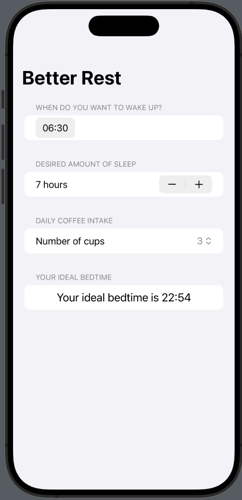

<h1 align="center"># BetterRest

## Overview

BetterRest is a SwiftUI-based iOS app designed to help users calculate their ideal bedtime based on their desired wake-up time, estimated sleep duration, and daily coffee intake. The app utilizes machine learning through CoreML to provide personalized sleep recommendations.

## Features

- Set your desired wake-up time using a convenient date picker.
- Adjust the desired amount of sleep with a stepper, ranging from 4 to 12 hours.
- Select your daily coffee intake using a picker from 1 to 20 cups.
- Receive personalized bedtime recommendations using a machine learning model.
- Real-time feedback on your ideal bedtime.

## Screenshots
<p align="center" style="display:flex; justify-content: space-between;">


</p>

## Getting Started

To run the BetterRest app on your local machine, follow these steps:

1. Clone the repository to your local machine:

   ```bash
   git clone https://github.com/your-username/BetterRest.git
